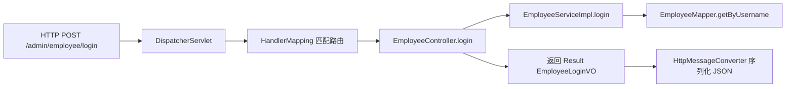

# Spring-Boot项目结构
这个文档旨在帮助我在局部编码后，整体理解一下项目springboot项目编码规范，认识springboot和普通Java项目的区别。

## 模式名称
springboot项目注解

## 1.我做了什么？

- 以EmployeeController类为例，我首先需要使用@RestController注解，标记这是一个控制器组件。

- 我还会使用@RequestMapping("/admin/employee")注解，我记得这是一个请求映射类注解。

- 我还会使用@Slf4j注解，这是自动生成日志对象的注解。

## 2. 我的疑问
一下疑问解答时，均以已完成员工相关功能模块为例子回答。

>Q1：为什么用@RestController而不是@Controller注解？这两个注解有什么异同点？

A1:
结论先记：做前后端分离接口时，优先 `@RestController`。

区别：
- `@Controller`：默认返回"视图名"（常用于 JSP/Thymeleaf 页面）
- `@RestController`：等价于 `@Controller + @ResponseBody`，默认返回 JSON

相同点：
- 都会被 Spring 扫描为控制器组件
- 都能使用 `@RequestMapping`、`@GetMapping`、`@PostMapping` 等注解

最小例子：

```java
@Controller
public class A {
	@GetMapping("/demo")
	public String demo() {
		return "index"; // 视图名
	}
}

@RestController
public class B {
	@GetMapping("/demo")
	public Result<String> demo() {
		return Result.success("ok"); // JSON
	}
}
```

---

>Q2：以登录请求为例子，这个@RequestMapping("/admin/employee")注解是怎么工作的？（spring怎么根据这个注解来处理登录请求的）

A2:
以你项目登录接口为例，请求路径是：`POST /admin/employee/login`。

工作过程：
1. 启动时，Spring 扫描到 `EmployeeController` 的类级别 `@RequestMapping("/admin/employee")` 和方法级别 `@PostMapping("/login")`
2. Spring 把它们组合成路由映射：`POST /admin/employee/login -> EmployeeController.login`
3. 请求到达时，`HandlerMapping` 找到目标方法，`HandlerAdapter` 调用它
4. `@RequestBody EmployeeLoginDTO` 由消息转换器把 JSON 反序列化成对象
5. 方法返回 `Result<EmployeeLoginVO>`，再被转换器序列化成 JSON 响应

流程图：



为什么不使用硬编码路由分发（灾难场景）：
- 如果不用注解映射，你需要自己维护大量 if-else 路由分发，接口一多就不可维护。

---

>Q3：@Slf4j注解是怎么工作的？它什么时候会生效并以何种方式展现出来？

A3:
`@Slf4j` 来自 Lombok，本质是编译期自动给类加一个日志字段：

```java
private static final org.slf4j.Logger log =
	org.slf4j.LoggerFactory.getLogger(CurrentClass.class);
```

什么时候生效：
- 在编译阶段（annotation processing）生成代码
- 运行时你调用 `log.info(...)`、`log.error(...)` 就会按日志框架配置输出到控制台/文件

你项目里的典型表现：
- `EmployeeController.login` 中 `log.info("员工登录：{}", employeeLoginDTO)`
- `JwtTokenAdminInterceptor.preHandle` 中 `log.info("jwt校验:{}", token)`

---

>Q4：@Autowired 是怎么把 Service 注入到 Controller 里的？为什么很多团队不推荐字段注入？

A4:
注入原理（你先抓主线）：
1. Spring 启动时扫描组件，创建 Bean（如 `EmployeeServiceImpl`）
2. 创建 `EmployeeController` 时，发现 `@Autowired` 依赖
3. 从 IoC 容器里按类型查找并注入对应 Bean

为什么不推荐字段注入（field injection）：
- 不利于单元测试（难以手动构造依赖）
- 依赖关系不显式（阅读构造器一眼看不出必须依赖）
- 对不可变设计不友好

更推荐构造器注入：

```java
@RestController
@RequestMapping("/admin/employee")
public class EmployeeController {

	private final EmployeeService employeeService;

	public EmployeeController(EmployeeService employeeService) {
		this.employeeService = employeeService;
	}
}
```

可记到 Obsidian 的关键词：
- IoC Container
- Dependency Injection
- Constructor Injection

---